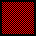
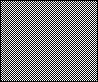

# Image

An `image` is a UI element with a texture that can have a color and an outline.
The difference between a `rectangle` and an `image` is that an image requires a texture.

### Example

```json
"image": {
  "id": "img",
  "texture": "background"
}
```

### Properties

Name              | Type    | Default      | Description
----------------- | ------- | ------------ | ----------------------------
`background`      | bool    | false        | automatically position background image
`color`           | color   | white        | fill color
`enableOutline`   | bool    | false        | enable outline (sprite shader)
`outline`         | color   | transparent  | outline color (sprite shader)
`outlineIgnore`   | color   | transparent  | outline ignore color (sprite shader)
`resizable`       | bool    | false        | resize image on window resize
`stretch`         | bool    | false        | stretch image on window resize
**`texture`**     | texture | null         | texture to use
`textureIndex`    | int     | 0            | texturePack image index to use
**`texturePack`** | texture | null         | texturePack to use
`textureRect`     | intRect | texture size | textureRect to use. If the property is present but invalid, the current window size is used

Properties in **bold** are required.  

An image requires a `texture` or a `texturePack`. If both properties are set, `texture` takes precedence.  

An image repeats the texture by default if the `textureRect` is bigger than the texture size.
The `size` of the image matches the `textureRect`.

A background image will be automatically centered in the screen and positioned/resized on window resize.
The properties `anchor`, `resizable`, `stretch`, `position` and `relativeCoords` are ignored when
`background` is `true`.  

The `image` drawable uses a composite sprite underneath. This means it can display images from `TexturePack`s
that use multiple images to make the final image.  

All images use the game's current sprite shader, which applies palettes and outline effects.

### Examples

#### Image (2x2)

```json
{
  "init": true,
  "texture": {
    "id": "pattern",
    "color": [
      "0xFFFFFF", "0x000000",
      "0x000000", "0xFFFFFF"
    ],
    "size": [2, 2]
  },
  "image": {
    "id": "img",
    "position": ["center", "center"],
    "texture": "pattern"
  }
}
```

#### Image (32x32) with texture repeated


```json
{
  "init": true,
  "texture": {
    "id": "pattern",
    "color": [
      "0xFFFFFF", "0x000000",
      "0x000000", "0xFFFFFF"
    ],
    "size": [2, 2]
  },
  "image": {
    "id": "img",
    "position": ["center", "center"],
    "texture": "pattern",
    "textureRect": [32, 32]
  }
}
```

#### Image (32x32) with texture repeated and red fill color



```json
{
  "windowSize": [704, 528],
  "init": true,
  "texture": {
    "id": "pattern",
    "color": [
      "0xFFFFFF", "0x000000",
      "0x000000", "0xFFFFFF"
    ],
    "size": [2, 2]
  },
  "image": {
    "id": "img",
    "position": ["center", "center"],
    "texture": "pattern",
    "textureRect": [32, 32],
    "color": "0xFF0000"
  }
}
```

#### Image (32x32) with texture repeated and expanding on resize



```json
{
  "windowSize": [704, 528],
  "init": true,
  "texture": {
    "id": "pattern",
    "color": [
      "0xFFFFFF", "0x000000",
      "0x000000", "0xFFFFFF"
    ],
    "size": [2, 2]
  },
  "image": {
    "id": "img",
    "anchor": "all",
    "position": ["center", "center"],
    "texture": "pattern",
    "textureRect": [32, 32],
    "resizable": true
  }
}
```

#### Image (32x32) with texture repeated and stretching on resize


```json
{
  "windowSize": [704, 528],
  "init": true,
  "texture": {
    "id": "pattern",
    "color": [
      "0xFFFFFF", "0x000000",
      "0x000000", "0xFFFFFF"
    ],
    "size": [2, 2]
  },
  "image": {
    "id": "img",
    "anchor": "all",
    "position": ["center", "center"],
    "texture": "pattern",
    "textureRect": [32, 32],
    "resizable": true,
    "stretch": true
  }
}
```

#### Background image

```json
{
  "init": true,
  "texture": {
    "id": "pattern",
    "color": [
      "0xFF0000", "0x000000",
      "0x000000", "0xFF0000"
    ],
    "size": [2, 2]
  },
  "image": {
    "id": "img",
    "texture": "pattern",
    "background": true
  }
}
```
