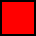
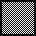
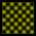
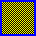

# Rectangle

A `rectangle` is a UI element with 4 sides and it can have a color, an outline or a texture.
The difference between a `rectangle` and an `image` is that an image requires a texture.

### Example

```json
"rectangle": {
  "id": "rect",
  "position": ["center", "center"],
  "size": [32, 32],
  "color": "0xFF0000"
}
```

### Properties

Name               | Type    | Default | Description
------------------ | ------- | ------- | ----------------------------
`color`            | color   | white   | fill color
`outlineColor`     | color   | white   | border/outline color
`outlineThickness` | int     | 0       | border thickness
`texture`          | texture | null    | texture to use
`textureRect`      | intRect | [0,0]   | textureRect to use. If the property is present but invalid, the current window size is used

Properties in **bold** are required.

### Examples

#### Rectangle with red fill



```json
{
  "init": true,
  "rectangle": {
    "id": "rect",
    "position": ["center", "center"],
    "size": [32, 32],
    "color": "0xFF0000"
  }
}
```

#### Rectangle with black and white checkers pattern texture



```json
{
  "init": true,
  "texture": {
    "id": "pattern",
    "color": [
      "0xFFFFFF", "0x000000",
      "0x000000", "0xFFFFFF"
    ],
    "size": [2, 2]
  },
  "rectangle": {
    "id": "rect",
    "position": ["center", "center"],
    "size": [32, 32],
    "texture": "pattern",
    "textureRect": [32, 32]
  }
}
```

#### Rectangle with stretched black and yellow checkers pattern texture



```json
{
  "init": true,
  "texture": {
    "id": "pattern",
    "color": [
      "0xFFFF00", "0x000000",
      "0x000000", "0xFFFF00"
    ],
    "size": [2, 2]
  },
  "rectangle": {
    "id": "rect",
    "position": ["center", "center"],
    "size": [32, 32],
    "texture": "pattern",
    "textureRect": [8, 8]
  }
}
```

#### Rectangle with black and white checkers pattern texture, blue 2px border and yellow fill color



```json
{
  "init": true,
  "texture": {
    "id": "pattern",
    "color": [
      "0xFFFFFF", "0x000000",
      "0x000000", "0xFFFFFF"
    ],
    "size": [2, 2]
  },
  "rectangle": {
    "id": "rect",
    "position": ["center", "center"],
    "size": [32, 32],
    "color": "0xFFFF00",
    "outlineColor": "0x0000FF",
    "outlineThickness": 2,
    "texture": "pattern",
    "textureRect": [32, 32]
  }
}
```
