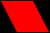

# Shape

A `shape` is a UI element that draws an array of vertices, each with a `position` and a `color`.  

The `type` of vertices can be one of the following:

Name            | Description
--------------- | ----------------------------
`points`        | list of individual points
`lines`         | list of individual lines
`lineStrip`     | list of connected lines. A point uses the previous point to form a line
`triangles`     | list of individual triangles
`triangleStrip` | list of connected triangles. A point uses the two previous points to form a triangle
`triangleFan`   | list of connected triangles. A point uses the common center and the previous point to form a triangle

### Example

```json
"shape": {
  "id": "shape1",
  "type": "triangleFan",
  "anchor": ["bottom", "left", "right"],
  "vertices": [
    { "position": [0, 352], "color": "0x00000000" },
    { "position": [640, 352], "color": "0x00000000" },
    { "position": [640, 480], "color": "0xFF0000" },
    { "position": [0, 480], "color": "0xFF0000" }
  ]
}
```

### Properties

Name               | Type    | Default     | Description
------------------ | ------- | ----------- | ----------------------------
`color`            | color   | white       | vertex color (vertex object)
`position`         | intVec  | [0,0]       | vertex position (vertex object)
`type`             | color   | triangleFan | type of vertices
**`vertices`**     | array   |             | vertices array of json objects with `position` and `color`

Properties in **bold** are required.  

When you `anchor` shapes, keep in mind the shape's `position` and `size` are used
to position the shape, not the position of the vertices.  

The drawing position of points is off by 1, so you need to add 1 to fix it (OpenGL related).

### Examples

#### Triangle shape using dots


```json
{
  "init": true,
  "shape": {
    "id": "shape1",
    "type": "points",
    "anchor": "none",
    "vertices": [
      { "position": [300, 240], "color": "0xFF0000" },
      { "position": [320, 200], "color": "0xFF0000" },
      { "position": [340, 240], "color": "0xFF0000" }
    ]
  }
}
```

#### Hollow triangle shape using lines


```json
{
  "init": true,
  "shape": {
    "id": "shape1",
    "type": "lines",
    "anchor": "none",
    "vertices": [
      { "position": [300, 240], "color": "0xFF0000" },
      { "position": [320, 200], "color": "0xFF0000" },
      { "position": [320, 200], "color": "0xFF0000" },
      { "position": [340, 240], "color": "0xFF0000" },
      { "position": [340, 240], "color": "0xFF0000" },
      { "position": [300, 240], "color": "0xFF0000" }
    ]
  }
}
```

#### Hollow triangle shape using lineStrips


```json
{
  "init": true,
  "shape": {
    "id": "shape1",
    "type": "lineStrip",
    "anchor": "none",
    "vertices": [
      { "position": [300, 240], "color": "0xFF0000" },
      { "position": [320, 200], "color": "0xFF0000" },
      { "position": [340, 240], "color": "0xFF0000" },
      { "position": [300, 240], "color": "0xFF0000" }
    ]
  }
}
```

#### 2 Filled triangles shape using triangles


```json
{
  "init": true,
  "shape": {
    "id": "shape1",
    "type": "triangles",
    "anchor": "none",
    "vertices": [
      { "position": [278, 240], "color": "0xFF0000" },
      { "position": [298, 200], "color": "0xFF0000" },
      { "position": [318, 240], "color": "0xFF0000" },
      { "position": [322, 240], "color": "0xFF0000" },
      { "position": [342, 200], "color": "0xFF0000" },
      { "position": [362, 240], "color": "0xFF0000" }
    ]
  }
}
```

#### Filled Parallelogram shape using triangleStrips


```json
{
  "init": true,
  "shape": {
    "id": "shape1",
    "type": "triangleStrip",
    "anchor": "none",
    "vertices": [
      { "position": [280, 240], "color": "0xFF0000" },
      { "position": [300, 200], "color": "0xFF0000" },
      { "position": [320, 240], "color": "0xFF0000" },
      { "position": [340, 200], "color": "0xFF0000" }
    ]
  }
}
```

#### Filled Parallelogram shape using triangleFans



```json
{
  "init": true,
  "shape": {
    "id": "shape1",
    "type": "triangleFan",
    "anchor": "none",
    "vertices": [
      { "position": [320, 240], "color": "0xFF0000" },
      { "position": [300, 200], "color": "0xFF0000" },
      { "position": [340, 200], "color": "0xFF0000" },
      { "position": [360, 240], "color": "0xFF0000" }
    ]
  }
}
```

#### Shape with red gradient from bottom to top anchored to the bottom and stretching on resize


```json
{
  "init": true,
  "shape": {
    "id": "shape1",
    "type": "triangleFan",
    "anchor": ["bottom", "left", "right"],
    "vertices": [
      { "position": [0, 352], "color": "0x00000000" },
      { "position": [640, 352], "color": "0x00000000" },
      { "position": [640, 480], "color": "0xFF0000" },
      { "position": [0, 480], "color": "0xFF0000" }
    ]
  }
}
```
